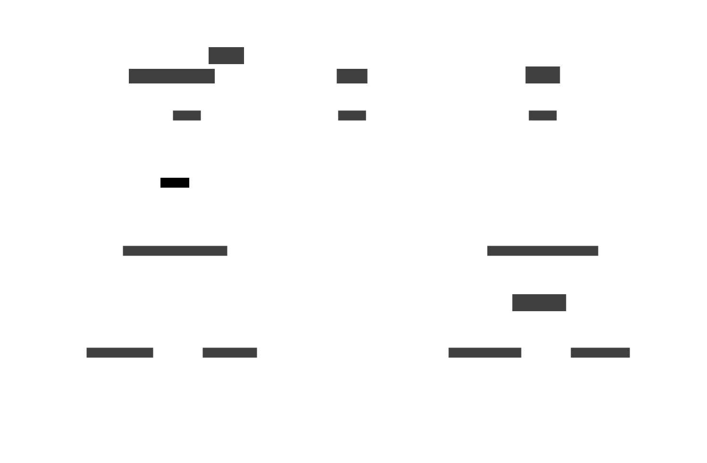
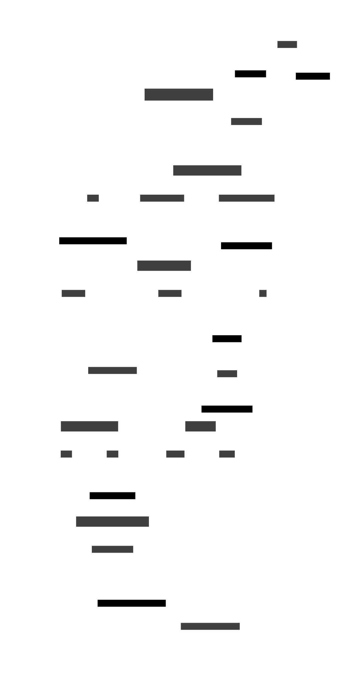

# Go-Drink Architecture

Go-Drink is, for now, a simple Go-Backend providing functionality
for a hackerspace to manage their drink-fridge.

At this time, an embedded (go-)html frontend is planned, as well
as interfaces to interact with a qr-code / bar-code scanner and NFC-based payments.

## (planned) Systems-Level Architecture

[Systems-Level Architecture Diagram Source Code (d2lang)](./system-architecture.d2)

## Backend Overview

The rough structure of the backend is as follows:

[Backend Architecture Diagram Source Code (d2lang)](./backend-architecture.d2)

This diagram shows the flow of data through an HTTP-Request.

In a nutshell, a `RequestHandler` is chosen to deal with an incoming request.
This is a function that receives the request, calls the appropriate logic (e.g. adding a user)
and can then return some data (normal go objects of any kind).

The `RequestHandler` calls internal services to perform the core functions of the app.
These services can use the database or whatever appropriate to do this task.

Then, a `ResponseMapper` is chosen (based on the `Accept:` Header of the Http-Request) and serializes
the return data into valid HTTP traffic, e.g. by converting it into JSON or parsing the data with
a gohtml template.

At both ends of the request, middlewares can modify the request or response to add cross-cutting
functionality like adding CORS-headers or making available and checking authentication data.

### Code structure

Currently, the implementation of `RequestHandler`s is in `handlers.go`.
They call into different packages which implement different domains of the app.
The handlers are assembled into an HTTP-Server in `main.go`, which uses the 
utility-functions of `handlerUtil.go` to implement specific middlewares.

For this purpose, it uses different utilities from the `handlehttp` package,
which houses types such as `RequestHandler` and `ResponseMapper` and functions to 
connect them into handlers for the go standard `http.HandleFunc`.
It also houses some copied code to deal with HTTP's `Content-Type` and the mappers
for HTML and JSON.
